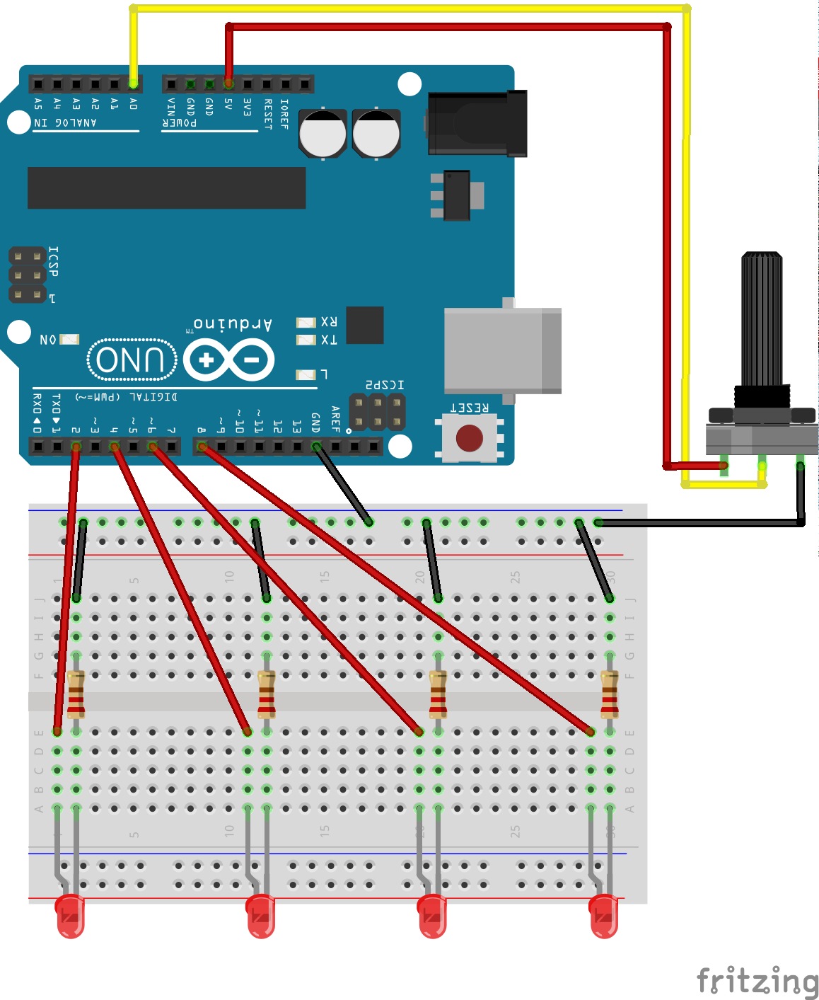

# Potentiometer Led Array, N (e.g. 4) Leds, 1 Potentiometer

Map all possible values of a potentiometer to the number (N) of the leds. Toggle the corresponding led to the position of the potentiometer.

